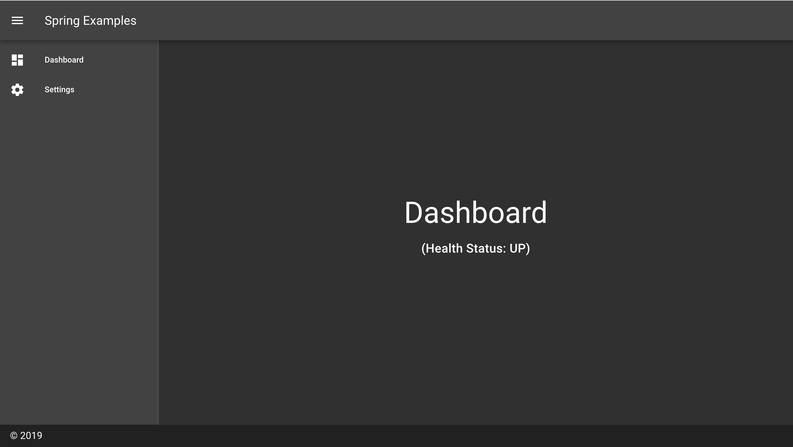

# Spring Boot and Vue.js, Vuetify example without npm, webpack 

<p align="center">
  
</p>

Vue.js 및 Vuetify로 웹 클라이언트를 작성하고, Spring Boot로 웹 애플리케이션을 구성한 예제이다. 웹 클라이언트를 작성할 때 [npm](https://www.npmjs.com
)과 [webpack](https://webpack.js.org) 등 프론트엔드 도구를 사용하지 않고, [webjars](https://webjars.org)로 의존성을 구성, 최신 브라우저의 ES6
++ 지원을 믿고 코드를 작성했다. [@babel/standalone](https://babeljs.io/docs/en/babel-standalone
)를 적용하면 구형 브라우저 지원도 가능하다.

다양한 프론트엔드 도구들이 주는 몇가지 장점을 포기하고 단순하고 쉽게 구성했다. 전문적인 프론트엔드 엔지니어가 없는 상황이고, 대규모 사용자를 대하는 서비스가 아니라면 유용하게 써먹을 수 있는 구조다.

## 프로젝트 구성

* Spring Boot 2.1.x with web, thymeleaf, actuator
* Vue.js 2.6.x
* Vuetify 2.0.x

### 디렉토리 구조

```
├── gradle
├── gradlew
├── gradlew.bat
├── settings.gradle
├── build.gradle
└── src
    ├── main
    │   ├── java
    │   └── resources
    │       ├── static                                   # Spring Boot 정적 자원 제공 디렉토리
    │       │   └── assets
    │       │       ├── css
    │       │       └── js                               # Vue.js 소스 코드
    │       │           ├── components
    │       │           │   └── Navigation.vue.js
    │       │           ├── pages
    │       │           │   ├── DashboardPage.vue.js
    │       │           │   └── NotFoundPage.vue.js
    │       │           ├── App.vue.js
    │       │           └── main.js
    │       └── templates
    │           └── index.html                           # Thymeleaf로 작성된 웹 클라이언트 진입점
    └── test
```

### 실행

```
$ ./gradlew bootRun
```

터미널에서 위 명령 수행 후 브라우저로 `http://localhost:8080/`에 접속한다.